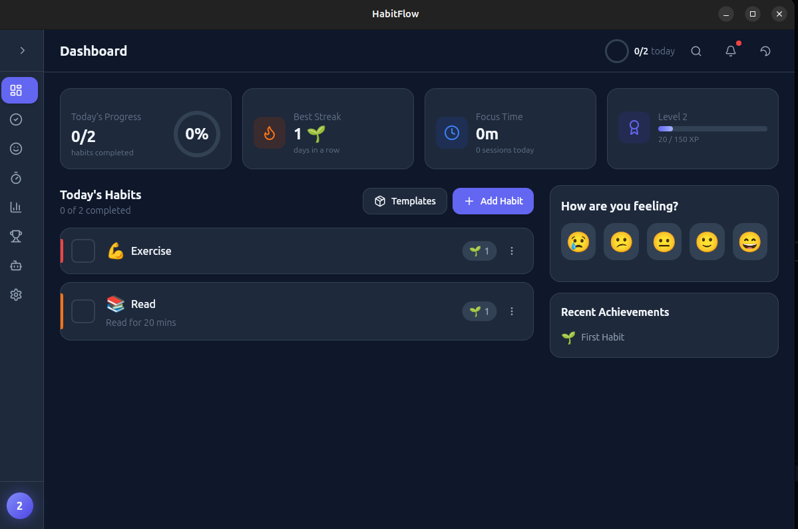
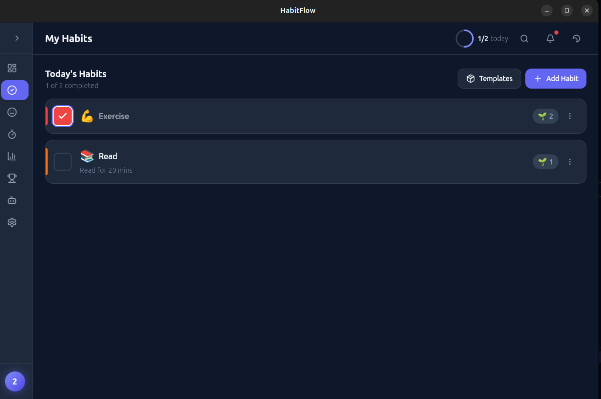
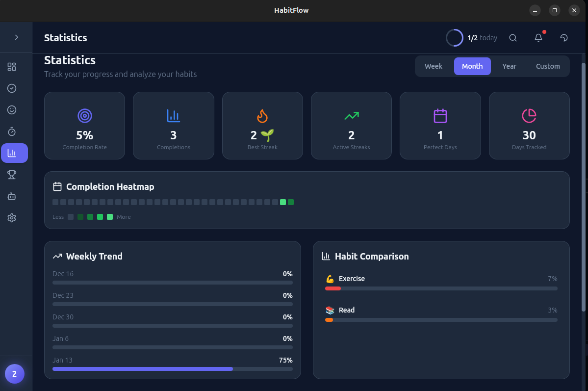
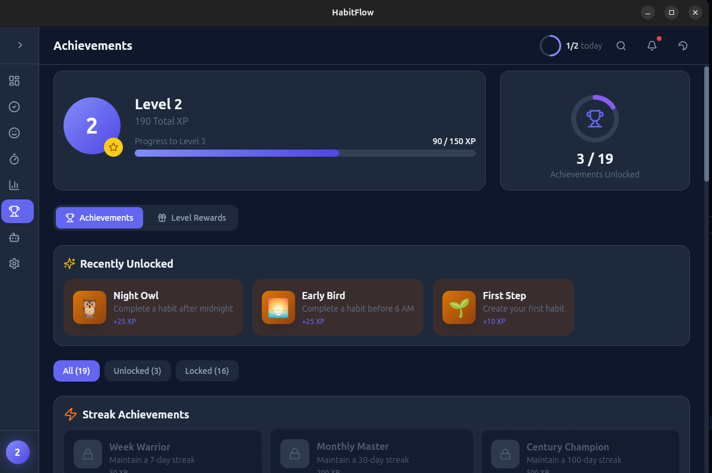
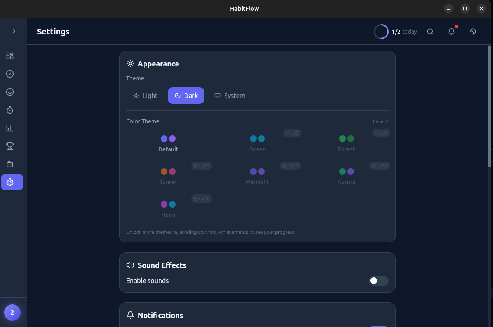
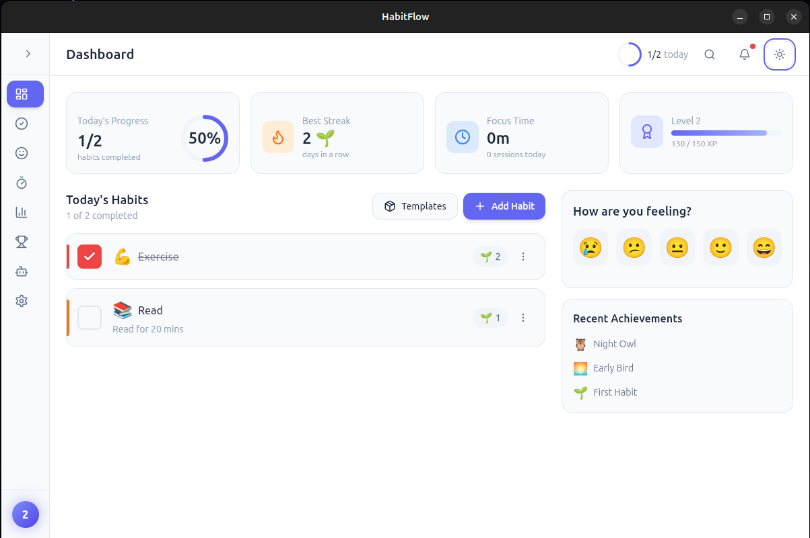

<div align="center">

# HabitFlow

### A Beautiful, Gamified Habit Tracker for Linux

[](https://opensource.org/licenses/MIT)
[](https://tauri.app)
[](https://react.dev)
[](https://www.typescriptlang.org)

Build better habits with a delightful, native Linux app. Track habits, log moods, focus with Pomodoro, and level up your life.

[Features](#features) • [Installation](#installation) • [Development](#development) • [Contributing](#contributing)

---

</div>

## Features

### Core Functionality

- **Habit Tracking** - Create and track daily, weekly, or custom habits with beautiful animations
- **Mood Journal** - Log your mood with emojis and journal entries, track patterns over time
- **Pomodoro Timer** - Built-in focus timer with work/break sessions linked to habits
- **Statistics Dashboard** - GitHub-style heatmaps, charts, and insights into your progress

### Gamification System

- **XP & Levels** - Earn experience points for completing habits and maintaining streaks
- **Achievements** - Unlock 18+ achievements across streaks, habits, mood, and Pomodoro categories
- **Level Rewards** - Unlock themes, icon packs, sound effects, and habit templates as you level up

### Unlockable Content

| Level | Rewards |
|-------|---------|
| 3 | Ocean Theme |
| 5 | Fitness Icons, Starter Badge |
| 8 | Forest Theme, Morning Routine Template |
| 10 | Chime Sounds, Productivity Icons |
| 15 | Sunset Theme, Fitness Template |
| 20 | Midnight Theme, Nature Sounds, Mindfulness Template |
| 25+ | Aurora/Neon Themes, Premium Icons, Developer Template |

### Additional Features

- **Dark/Light Mode** - Automatic system theme detection or manual toggle
- **7 Color Themes** - Personalize your app with Ocean, Forest, Sunset, Midnight, Aurora, or Neon themes
- **Sound Effects** - Satisfying completion sounds with 4 unlockable sound packs
- **Local Storage** - Your data stays on your device, no cloud required
- **Native Performance** - Built with Tauri for fast, lightweight desktop experience

---

## Installation

### Quick Install (Recommended)

```bash
# Clone the repository
git clone https://github.com/Bhavyyadav25/Habit-Tracker.git
cd Habit-Tracker

# Run the install script
./scripts/install.sh
```

### Manual Installation

#### Prerequisites

Make sure you have the following installed:

- **Node.js 18+**
  ```bash
  curl -fsSL https://deb.nodesource.com/setup_18.x | sudo -E bash -
  sudo apt-get install -y nodejs
  ```

- **Rust**
  ```bash
  curl --proto '=https' --tlsv1.2 -sSf https://sh.rustup.rs | sh
  source $HOME/.cargo/env
  ```

- **Tauri Dependencies** (Ubuntu/Debian)
  ```bash
  sudo apt update
  sudo apt install -y libwebkit2gtk-4.1-dev build-essential curl wget \
    file libssl-dev libayatana-appindicator3-dev librsvg2-dev
  ```

#### Build & Run

```bash
# Install dependencies
npm install

# Run in development mode
npm run tauri dev

# Build for production
npm run tauri build
```

The built application will be in `src-tauri/target/release/bundle/`.

---

## Development

### Project Structure

```
habitflow/
├── src/                    # React frontend
│   ├── components/         # UI components
│   │   ├── ui/            # Reusable components (Button, Card, Modal)
│   │   ├── habits/        # Habit tracking components
│   │   ├── mood/          # Mood journaling
│   │   ├── pomodoro/      # Pomodoro timer
│   │   ├── stats/         # Statistics & dashboard
│   │   ├── achievements/  # Achievements & rewards
│   │   ├── settings/      # Settings page
│   │   └── layout/        # Sidebar, Header
│   ├── stores/            # Zustand state management
│   ├── lib/               # Utilities, constants, animations
│   └── types/             # TypeScript definitions
├── src-tauri/             # Rust backend
│   └── src/
│       ├── commands/      # Tauri commands
│       └── db/            # SQLite database
└── public/                # Static assets
```

### Tech Stack

| Layer | Technology |
|-------|------------|
| Framework | [Tauri 2.0](https://tauri.app) |
| Frontend | [React 18](https://react.dev) + [TypeScript](https://www.typescriptlang.org) |
| Styling | [Tailwind CSS](https://tailwindcss.com) |
| Animations | [Framer Motion](https://www.framer.com/motion) |
| State | [Zustand](https://zustand-demo.pmnd.rs) |
| Charts | [Recharts](https://recharts.org) |
| Icons | [Lucide React](https://lucide.dev) |
| Database | SQLite (via rusqlite) |

### Available Scripts

```bash
npm run dev          # Start Vite dev server (frontend only)
npm run build        # Build frontend for production
npm run tauri dev    # Start Tauri in development mode
npm run tauri build  # Build native application
```

---

## Contributing

We welcome contributions! Please see our [Contributing Guide](CONTRIBUTING.md) for details.

### Quick Start

1. Fork the repository
2. Create a feature branch: `git checkout -b feature/amazing-feature`
3. Make your changes
4. Run tests and ensure code quality
5. Commit with a descriptive message: `git commit -m "Add amazing feature"`
6. Push to your fork: `git push origin feature/amazing-feature`
7. Open a Pull Request

### Ideas for Contributions

- [ ] Cloud sync support
- [ ] Mobile companion app
- [ ] Widget for desktop
- [ ] Import/export to other habit trackers
- [ ] Additional themes and icon packs
- [ ] Localization (i18n)
- [ ] AI-powered insights (Ollama integration)

---

## Screenshots

<div align="center">

| Dashboard | Habits | Statistics |
|-----------|--------|------------|
|  |  |  |

| Achievements | Settings | Light Mode |
|--------------|----------|------------|
|  |  |  |

</div>


---

## Roadmap

- [x] Core habit tracking
- [x] Mood journaling
- [x] Pomodoro timer
- [x] Statistics dashboard
- [x] Gamification (XP, levels, achievements)
- [x] Unlockable themes & customization
- [x] Sound effects
- [ ] System tray integration
- [ ] Desktop notifications
- [ ] Cloud sync (optional)
- [ ] AI coach integration

---

## License

This project is licensed under the MIT License - see the [LICENSE](LICENSE) file for details.

---

## Acknowledgments

- Built with [Tauri](https://tauri.app) - for making native apps with web tech
- Icons by [Lucide](https://lucide.dev)
- Animations powered by [Framer Motion](https://www.framer.com/motion)

---

<div align="center">

**Made with love for the Linux community**

[Report Bug](https://github.com/Bhavyyadav25/Habit-Tracker/issues) • [Request Feature](https://github.com/Bhavyyadav25/Habit-Tracker/issues)

</div>
